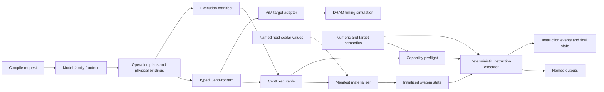

# Functional simulator design

Status: **Accepted; the reviewed machine-foundation slice is implemented**  
Design base: repository commit `1aa7d1b`  
Scope: functional execution of typed `CentProgram` objects and the runtime data
contract needed to validate compiler output numerically

## 1. Decision statement

Build a deterministic, instruction-level functional simulator in Python. It
will execute the repository's typed CENT intermediate representation directly,
using explicit host inputs and physical tensor bindings. It will model values
and state changes, not time.

The functional simulator and AiM are separate targets:

- The functional simulator answers, "What values does this program produce?"
- AiM answers, "How does the DRAM-side trace behave under its timing model?"

A successful run through one target does not imply compatibility with the
other. Both targets consume the same typed `CentProgram`; neither is allowed to
silently discard meaning it cannot represent.

## 2. Goals

The simulator must:

1. Execute every instruction whose numerical and data-movement semantics are
   known.
2. Reject an instruction before execution when required semantics are missing.
3. Detect reads from uninitialized memory, registers, or message state.
4. Preserve exact channel, bank, row, column, Shared Buffer, register, and
   device boundaries.
5. Load named values through a typed runtime manifest rather than hidden test
   setup.
6. Return named outputs through the same manifest. Raw regions stay explicitly
   raw until a later logical binding defines shape, packing, and zero padding.
7. Provide deterministic instruction events that explain a wrong result.
8. Validate lowerers first on hand-checkable examples, then against trusted host
   implementations of RMSNorm, GEMV, attention, and a Llama block.
9. Keep all simulator machinery independent of Llama and other model families.

## 3. Non-goals

The first simulator is not:

- a cycle, latency, bandwidth, energy, or contention model;
- an alternative parser for the text or AiM trace formats;
- a vLLM worker, scheduler, sampler, or KV-cache manager;
- a layout optimizer or cost model;
- permission to guess undocumented CENT semantics;
- a high-performance whole-model engine.

Correctness and explainability come before dense storage, vectorization,
parallel execution, or accelerator-specific optimizations.

## 4. System boundary



The compiler remains responsible for choosing addresses and emitting complete
dataflow. The manifest explains what the chosen addresses contain. The
simulator only executes that contract; it must not repair missing compiler
instructions behind the compiler's back.

## 5. Package boundaries

The runtime-data contract and the functional simulator should be separate
packages because a future hardware runtime will reuse the manifest without
reusing the Python simulator.

```text
src/vllm_cent/
    runtime/
        __init__.py
        executable.py     CentExecutable and execution manifests
        bindings.py       named raw scalars and reusable physical regions
    simulator/
        __init__.py
        errors.py         stable simulator failure types
        numeric.py        scalar formats and arithmetic policies
        storage.py        private storage components
        state.py          device aggregate and atomic cross-region commits
        effects.py        immutable prepared instruction writes
        kernels.py        effect preparation for supported instructions
        semantics.py      support registry, resolution, and preflight
        execution.py      sequential atomic commits and summaries
        api.py            manifest materialization, extraction, and events
```

The initial implementation should add only the files needed by its current
milestone. For example, `cxl.py` should not be created until CXL semantics are
defined and tested.

The packages have these ownership rules:

- `vllm_cent/cent/` continues to own target-independent hardware,
  instructions, validation, programs, building, and rendering.
- `vllm_cent/runtime/` owns reusable raw host-value and physical-region
  contracts. A future logical layer belongs here only after its layout is
  proven.
- `vllm_cent/simulator/` owns one functional execution target.
- `vllm_cent/lowering/` and `vllm_cent/models/` may create bindings and
  manifests, but may not inspect or mutate simulator state.

## 6. Public API

The intended small public boundary is:

```python
@dataclass(frozen=True, slots=True, kw_only=True)
class CentExecutable:
    program: CentProgram
    manifest: CentExecutionManifest


@dataclass(frozen=True, slots=True, kw_only=True)
class CentExecutionRequest:
    executable: CentExecutable
    inputs: tuple[CentNamedScalars, ...]
    configuration: CentSimulatorConfiguration


@dataclass(frozen=True, slots=True, kw_only=True)
class CentExecutionResult:
    outputs: tuple[CentNamedScalars, ...]
    events: tuple[CentExecutionEvent, ...]
    executed_instruction_count: int


def execute_functionally(request: CentExecutionRequest) -> CentExecutionResult: ...
```

`CentProgram` remains the pure instruction IR. It should not absorb weights,
request data, mutable memory, or simulator configuration.

Multi-device execution extends, rather than changes, this boundary:

```python
@dataclass(frozen=True, slots=True, kw_only=True)
class CentDeviceExecutable:
    device_id: int
    executable: CentExecutable


@dataclass(frozen=True, slots=True, kw_only=True)
class CentSystemExecutable:
    devices: tuple[CentDeviceExecutable, ...]
    topology: CentCxlTopology
```

The single-device function is the first public API. A system execution function
should become public only with the CXL milestone, after message semantics and
topology validation exist.

Tests for individual instructions also need a lower-level internal entry point
that runs a program against an explicitly constructed `CentSystemState`. That
entry point should remain private until an external debugger or runtime has a
concrete need for it.

## 7. Runtime manifest

### 7.1 Why the manifest is required

Instructions name physical locations but do not say what those locations mean.
For example, a DRAM row number does not identify whether it stores a weight
row, an activation partition, a KV-cache slice, or temporary work. The
simulator cannot derive that information from instruction order.

The compiler must therefore produce an immutable manifest beside the program.
The implemented foundation deliberately binds named raw scalar sequences to
reusable physical regions:

```python
CentPhysicalRegion = CentDramRegion | CentSharedBufferRegion | CentGlobalBufferRegion


@dataclass(frozen=True, slots=True, kw_only=True)
class CentInputBinding:
    name: str
    region: CentPhysicalRegion


@dataclass(frozen=True, slots=True, kw_only=True)
class CentOutputBinding:
    name: str
    region: CentPhysicalRegion


@dataclass(frozen=True, slots=True, kw_only=True)
class CentExecutionManifest:
    inputs: tuple[CentInputBinding, ...]
    outputs: tuple[CentOutputBinding, ...]
```

Input and output names are unique within their own direction, so mutable state
may retain one name across execution. Input regions may not overlap. Output
regions are read-only views and may overlap. Every region is checked against
the program's hardware, including the explicit per-channel Global Buffer
capacity.

A later logical tensor binding must additionally name:

- the tensor or runtime value;
- whether it is an input, persistent value, mutable cache, workspace, or
  output;
- its logical shape and scalar type;
- its physical binding;
- its packing and padding contract;
- whether the simulator may initialize it before instruction zero;
- whether and how it is returned after execution.

### 7.2 Future logical binding types

```python
class CentTensorRole(Enum):
    INPUT = auto()
    PARAMETER = auto()
    MUTABLE_STATE = auto()
    WORKSPACE = auto()
    OUTPUT = auto()


@dataclass(frozen=True, slots=True, kw_only=True)
class CentTensorBinding:
    name: str
    role: CentTensorRole
    logical_shape: tuple[int, ...]
    scalar_format: CentScalarFormat
    placement: CentPhysicalTensorBinding
```

`CentPhysicalTensorBinding` is a closed union of typed layouts, not a dictionary.
The first members should reuse `CentSharedBufferVector` and `CentDramVector`.
Additional members are required for weight matrices, accumulator-result spans,
key-cache rows, and value-cache rows. Those layouts already exist implicitly in
Llama planning and should become explicit reusable dataclasses instead of being
reconstructed by the simulator.

Logical bindings should wrap the implemented raw regions rather than replacing
them. Legal workspace aliasing remains deferred until the compiler records
non-overlapping live ranges or sequential reuse.

### 7.3 Materialization

Raw materialization currently performs these steps before instruction zero:

1. Validate that every required input appears exactly once.
2. Validate its scalar count against the bound physical region.
3. Convert host values through the selected numeric policy exactly once.
4. Atomically write the complete raw region.
5. Leave all other state uninitialized.

Output extraction returns raw lane order. Future logical materialization will
add shape validation, packing, explicit zero padding, and reverse unpacking.

## 8. Machine state

### 8.1 Device state

Each simulated device contains:

- sparse DRAM rows addressed by channel, bank, and row;
- one Shared Buffer containing `shared_buffer_slots * burst_length` lanes;
- one Global Buffer per channel;
- one accumulator scalar for every channel, bank, and register;
- one activation-result scalar for every channel, bank, and register;
- execution position and completion state;
- pending CXL messages when multi-device execution is enabled.

DRAM should be sparse. Llama dimensions reserve many rows, but a focused test
touches only a small fraction. An absent row means uninitialized data, not
zero-filled memory.

The correctness backend should use standard-library Python storage and require
no NumPy or PyTorch runtime dependency. It is intended for small,
hand-checkable executions. A later vectorized storage backend may implement the
same private memory interface only after it passes the identical instruction
and failure-semantics suite. Large production model execution is not a reason
to weaken the reference backend's checks.

The Shared Buffer, Global Buffers, accumulators, and activation results also
begin uninitialized. A source read fails unless a manifest initializer or a
previous instruction wrote every consumed value.

### 8.2 Initialized-value tracking

The simulator must distinguish these states:

- uninitialized;
- initialized numeric value, including positive or negative zero;
- NaN or infinity when the selected numeric profile permits them.

It must not use numeric zero as the uninitialized marker. Internally, a private
sentinel or a parallel initialization bitmap is acceptable. Public APIs expose
only typed values and errors.

### 8.3 Hardware description additions

`CentHardwareSpec.global_buffer_columns` now records explicit scalar capacity
per channel. Before hardware-faithful execution, the target still needs
source-backed fields for:

- scalar storage format;
- supported activation identifiers;
- PNM-unit and RISC-V capabilities when they affect execution;
- any accumulator precision or rounding behavior required by the ISA.

CXL topology belongs in a separate system specification because it relates
several devices; it is not a property of one device.

## 9. Numeric semantics

Numerical behavior is configuration, not an implicit use of Python `float`.
The design supports two clearly labeled profiles.

### 9.1 Reference-math profile

This is the first implementation profile. It uses deterministic host arithmetic
to validate compiler dataflow and mathematical operations. Exact `exp`,
sigmoid, reciprocal, and square root may be used where the mathematical
operation is known.

Results from this profile prove compiler-level numerical behavior. They do not
claim bit-accurate CENT hardware behavior.

### 9.2 Hardware-fidelity profile

This profile is unavailable until the relevant sources define:

- BF16 conversion and rounding points;
- multiply and accumulator precision;
- overflow, underflow, NaN, infinity, and signed-zero behavior;
- the tenth-order `EXP` coefficients and range handling;
- activation lookup-table contents and interpolation behavior;
- `RED`, `ACC`, and RISC-V kernel precision.

The simulator must reject a request for this profile while any instruction in
the program lacks the requested fidelity. It must never fall back silently to
reference math.

### 9.3 Arithmetic interface

Instruction kernels use a typed `CentNumericSemantics` object for loads,
stores, multiply, accumulation, activation, and transcendental operations.
This keeps rounding policy out of instruction dispatch and permits the same
kernel tests to run against multiple profiles.

## 10. Execution model

### 10.1 Preflight

Before mutating state, preflight scans the entire executable and verifies:

- structural instruction validity;
- support for every instruction under the selected semantic profile;
- required activation IDs and RISC-V program counters;
- manifest coverage and physical capacity;
- CXL topology and message contracts when present;
- required instruction-level result layouts.

This prevents a program from executing a long valid prefix and then discovering
that a later opcode has no defined meaning.

### 10.2 Program order

One device executes instructions in tuple order. A channel mask means the
selected channel effects happen as one logical instruction. Functional
execution does not assign cycles or reorder independent work.

### 10.3 Instruction atomicity

Every instruction follows a three-step transaction:

1. Resolve and validate every source and destination.
2. Read all source values and compute all results into temporary typed deltas.
3. Commit all writes together.

If any source is uninitialized or any destination is invalid, the instruction
changes no state. Earlier completed instructions remain committed, matching an
execution fault rather than whole-program rollback.

Reading all sources before committing writes also makes exact in-place
operations deterministic. Partially overlapping source and destination ranges
remain unsupported unless the ISA defines their behavior.

### 10.4 Multi-device scheduling

After CXL semantics are defined, a system executor uses deterministic
round-robin scheduling by ascending device ID, executing at most one instruction
per runnable device per round.

A receive may block without changing state. If every unfinished device is
blocked and no queued message can unblock one, execution raises a typed
deadlock error containing each blocked device and instruction.

This scheduler defines functional ordering only; it does not model link timing
or performance.

## 11. Failure semantics

All failures derive from `CentSimulationError`. Stable subclasses should cover:

- `CentUnsupportedSemanticsError`: the selected profile cannot interpret an
  instruction or configuration;
- `CentManifestError`: host values and physical bindings disagree;
- `CentUninitializedReadError`: a source lane or register has no value;
- `CentExecutionFault`: a dynamic instruction constraint fails;
- `CentPaddingError`: a declared logical vector contains nonzero padding;
- `CentDeadlockError`: multi-device execution cannot make progress.

Every instruction-related error includes the device ID, zero-based instruction
index, typed instruction, affected address or register, and plain-language
reason. Tests should assert these fields rather than depending only on an error
message.

## 12. Instruction semantics and readiness

The status labels are:

- **Defined:** enough current evidence exists to implement and test functional
  behavior.
- **Configurable:** execution is valid only when an explicit registered kernel
  or numeric policy supplies the behavior.
- **Blocked:** required meaning is absent from the current typed instruction or
  source material.

| Instruction              | Functional effect                                                                                                                        | Status and required action                                                                                                        |
|--------------------------|------------------------------------------------------------------------------------------------------------------------------------------|-----------------------------------------------------------------------------------------------------------------------------------|
| `WR_SBK`                 | Copy consecutive Shared Buffer slots to one DRAM bank span.                                                                              | **Defined.** Read all source slots before writing DRAM.                                                                           |
| `RD_SBK`                 | Copy one DRAM bank span to consecutive Shared Buffer slots.                                                                              | **Defined.** Overwrite every destination lane.                                                                                    |
| `WR_GB`                  | Copy Shared Buffer slots to the Global Buffer of each selected channel.                                                                  | **Defined** once Global Buffer capacity is explicit.                                                                              |
| `COPY_BKGB`              | Copy the named bank span to each selected channel's Global Buffer.                                                                       | **Defined for the typed/AiM extension.** Keep the target-specific bank operand explicit.                                          |
| `COPY_GBBK`              | Copy each selected channel's Global Buffer span to its named bank.                                                                       | **Defined for the typed/AiM extension.**                                                                                          |
| `EW_MUL`                 | In every four-bank group, multiply bank positions 0 and 1 lane-wise and write position 2.                                                | **Defined by reference behavior.** Unused groups still require an explicit compiler/runtime policy.                               |
| `MAC_ABK`, Global Buffer | For every selected channel and bank, dot the DRAM bursts with that channel's Global Buffer and add into the named accumulator.           | **Defined by reference behavior.** Numeric precision is profile-dependent.                                                        |
| `MAC_ABK`, next bank     | For every selected channel and even/odd pair, dot bank 0-of-pair with bank 1-of-pair and accumulate into the even bank's named register. | **Defined by reference behavior.** Odd-bank result state is unchanged.                                                            |
| `AF`                     | Apply the registered activation to each selected bank's named accumulator and store an activation result.                                | **Configurable.** The activation-ID registry must contain the selected ID.                                                        |
| `RD_AF`                  | Pack selected activation results into Shared Buffer output.                                                                              | **Blocked** by the same multi-channel packing question as `RD_MAC`.                                                               |
| `ACC`                    | Add matching Shared Buffer lanes into the destination in place.                                                                          | **Defined for disjoint ranges or exact alias.** Reject partial overlap until specified.                                           |
| `WR_ABK`                 | Distribute one source slot across banks at one row and column.                                                                           | **Blocked.** Confirm behavior on non-paper bank counts and the purpose of `Regid`.                                                |
| `WR_BIAS`                | Initialize bank accumulators from one Shared Buffer slot.                                                                                | **Blocked.** The typed instruction does not identify the destination register. Do not infer it from the next instruction.         |
| `RD_MAC`                 | Pack selected bank accumulator results into the Shared Buffer.                                                                           | **Blocked.** Define channel and bank lane order, slot count, padding, and behavior for inactive banks.                            |
| `EXP`                    | Apply elementwise exponential to Shared Buffer values.                                                                                   | **Reference math configurable; hardware fidelity blocked.** Define approximation and special-value behavior.                      |
| `RED`                    | Reduce Shared Buffer values.                                                                                                             | **Blocked.** Define operator, grouping, output footprint, and padding treatment.                                                  |
| `RISCV`                  | Execute a registered host kernel for a program counter.                                                                                  | **Configurable.** Each registration declares input/output footprints, aliasing, and numeric behavior. Unknown PCs fail preflight. |
| `SEND_CXL`               | Enqueue a typed payload for another device.                                                                                              | **Blocked.** Define payload size and message boundary.                                                                            |
| `RECV_CXL`               | Consume a matching message and complete its remote write.                                                                                | **Blocked.** Define matching, ordering, and failure behavior.                                                                     |
| `BCAST_CXL`              | Send one payload to a defined device set.                                                                                                | **Blocked.** Define recipients, sender inclusion, wrapping, and payload size.                                                     |

The simulator keeps behavior outside the pure instruction dataclasses. One
typed, simulator-owned registry resolves concrete instruction classes using
`isinstance` semantics so subclasses inherit their parent behavior. Each
registration bundles capability preflight with the matching effect kernel;
preflight and execution therefore cannot maintain divergent support lists. The
simulator does not dispatch through opcode strings, render and reparse
instructions, or use neighboring instructions to guess hidden state.

## 13. Required IR and compiler contract changes

The simulator exposes several ambiguities that must be fixed at their source.

### 13.1 `WR_BIAS` destination register

The compiler currently emits one `WR_BIAS` before operations using a known
accumulation register, but `WR_BIAS` itself carries no register. Inferring the
register from a later `MAC_ABK` is fragile and gives the same instruction
different meanings depending on context.

Before numerical MAC execution, one of these source-backed decisions is needed:

1. add semantic accumulator selection to the typed IR and let target adapters
   lower it to physical hidden state; or
2. prove that `WR_BIAS` initializes a fixed register or all registers and update
   lowerers accordingly.

### 13.2 Accumulator-result packing

`RD_MAC` and `RD_AF` need an explicit result-layout contract. The preferred
shape is a target-level immutable layout that states:

- selected-channel order;
- bank order within a channel;
- slots occupied per channel;
- live and inactive lanes;
- padding values;
- whether results are raw or a logical vector.

The simulator must not treat a capacity span as a logical vector. Repacking
from raw accumulator results into model vectors must remain an emitted compiler
operation or a documented runtime operation represented in the executable.

### 13.3 PNM operation types

`RED` needs a typed operation, not the generic word "reduction." RISC-V entry
points need a registry with symbolic meaning. `EXP` needs a numeric profile.
These semantics should be added to the IR or target configuration only after
they are established from the paper, hardware owners, or the execution target.

### 13.4 Inactive work

Channel masks do not disable individual PU groups. The compiler must either:

- initialize every inactive input to a mathematically neutral value and ignore
  its raw result; or
- use a source-backed mask/control mechanism.

The simulator will expose stale inactive data as a real failure. It will not
pretend inactive groups did not execute.

## 14. Execution events

Tracing is typed and opt-in. The implemented levels are:

- `NONE`: outputs and instruction count only;
- `SUMMARY`: instruction index, opcode, and affected regions;

`VALUES` is a future level that would add source and destination values for
small tests only after the lane-limit contract below is implemented.

An event records the device, instruction index, typed instruction, reads,
writes, and optional values. State deltas use typed address variants rather
than formatted strings.

Large tensors should not be copied into every event. Value tracing enforces a
configurable lane limit and reports an explicit truncation count. Deterministic
events can be compared in tests and correlated with an AiM trace by instruction
index, but they are not timing records.

## 15. Testing strategy

Tests are written before each implementation slice.

### 15.1 Numeric and state tests

- scalar conversion, rounding, signed zero, NaN, and infinity for each supported
  profile;
- sparse DRAM addressing and row isolation;
- Shared and Global Buffer bounds;
- uninitialized reads;
- accumulator and activation-register independence;
- instruction atomicity on failure.

### 15.2 Instruction tests

Every supported instruction receives direct tests with a tiny target such as:

- one or two channels;
- four banks per channel;
- two rows;
- eight scalar columns;
- two- or four-value bursts;
- two accumulator registers.

Expected values are calculated by hand. Tests cover channel masks, bank groups,
multiple bursts, nonzero columns, padding, invalid addresses, uninitialized
sources, and unsupported semantic profiles.

### 15.3 Lowerer integration tests

For each lowerer:

1. construct a small plan;
2. materialize named logical inputs;
3. lower it to a `CentProgram`;
4. execute the exact emitted instructions;
5. unpack the declared output;
6. compare every logical and padding lane with a trusted host function.

The first sequence is transfer, `ACC`, `EW_MUL`, sum-of-squares, RMSNorm, GEMV,
activation, attention stages, and the FFN.

Small host references should use straightforward Python arithmetic so the core
CI remains lightweight. A separate optional conformance suite may compare
larger operations with PyTorch when that dependency is available; PyTorch is an
oracle, not part of the simulator's execution implementation.

### 15.4 Metamorphic checks

Deterministic small randomized tests should verify properties such as:

- storing then loading a vector preserves all logical values and zeros;
- adding zero preserves a vector;
- multiplying by one preserves logical values and padding;
- splitting a dot product across rows matches one host dot product;
- changing an inactive or padding lane cannot change a logical result when the
  compiler claims that lane is neutral.

Random seeds are fixed and failures report the generated case.

## 16. Implementation milestones

### Milestone 0: accept the execution contract

Resolve or explicitly defer:

- `WR_BIAS` register selection;
- `RD_MAC`/`RD_AF` packing;
- the first numeric profile;
- the runtime manifest boundary.

Acceptance: the accepted decisions are recorded in `docs/decisions/README.md`
and affected code TODOs are updated.

### Milestone 1: deterministic machine foundation

Implement raw manifests, componentized initialization-aware state, reference
numeric semantics, preflight, atomic instruction effects, and transfers with
defined behavior.

Acceptance: direct tests prove raw load/store round trips, uninitialized-read
failures, and no partial mutation on an instruction fault. Logical packing and
explicit zero-padding validation move to Milestone 3.

### Milestone 2: near-bank arithmetic

Implement `EW_MUL`, both `MAC_ABK` modes, `WR_BIAS`, `RD_MAC`, activation, and
`RD_AF` after their blocked contracts are resolved.

Acceptance: hand-calculated bank-pair sum-of-squares and small GEMV programs
match reference math, including multi-channel result order.

### Milestone 3: complete RMSNorm

Add the missing reduction and reciprocal-square-root dataflow to the compiler,
materialize input and learned weights, and return a logical output vector.

Acceptance: a small vector with nontrivial per-partition padding matches the
host formula for every output and leaves every padding lane zero. No scale or
partial result is injected after instruction zero unless the executable
manifest explicitly identifies it as an input.

### Milestone 4: GEMV and reusable repacking

Complete raw accumulator packing, partial sums across input rows, output-bank
filtering, and conversion to logical vectors.

Acceptance: single-row and multi-row GEMV, with and without sigmoid, match host
reference results for outputs that do and do not fill the final bank/slot.

### Milestone 5: attention and FFN

Define and implement `EXP`, `RED`, required RISC-V kernels, RoPE, softmax,
cache updates, attention output, SiLU, and residual paths.

Acceptance: each reusable stage first matches independently; then one small
Llama block matches a trusted host implementation at every named boundary.

### Milestone 6: multi-device CXL

Define payloads, recipients, receive matching, queues, and deterministic
scheduling. Implement CXL instructions only after those decisions exist.

Acceptance: point-to-point, broadcast, blocking receive, and deadlock tests pass
on at least three tiny devices.

### Milestone 7: serving boundary

Expose executable compilation and state persistence to the future CENT
worker/model runner. Keep vLLM scheduling and logical KV ownership outside the
simulator.

Acceptance: one GPU-prefilled request can provide a documented KV/runtime
manifest, execute one CENT decode step, return logits, and match a trusted host
reference.

## 17. First implementation slice

After design approval, the first code change should implement only:

1. `CentExecutable`, reusable raw physical regions, and named input/output
   bindings sufficient for instruction tests;
2. sparse DRAM, Shared Buffer, Global Buffer, accumulator, and activation state;
3. reference-math numeric semantics;
4. preflight and atomic sequential execution;
5. `WR_SBK`, `RD_SBK`, `WR_GB`, `COPY_BKGB`, `COPY_GBBK`, `EW_MUL`, and `ACC`;
6. exhaustive unit tests for those components.

This slice deliberately stops before `WR_BIAS` and `RD_MAC`. It establishes the
engine and catches memory/dataflow bugs while the blocking MAC result contracts
are resolved. It must not modify Llama lowering or claim RMSNorm execution.

Implementation status: complete for this boundary. The reviewed implementation
uses a small program loop, an external semantics registry, one private kernel
per supported instruction, immutable prepared writes, one atomic batch commit,
and a deliberately narrow public request/result API. Summary events report
exact physical read regions and regions from committed write effects.
Value-heavy tracing remains deferred.

## 18. Completion definition

The simulator is complete for a program only when:

- preflight reports support for every instruction and semantic profile;
- every runtime input is named and materialized through the manifest;
- no instruction reads uninitialized state;
- every public operation emits its complete mathematical result;
- raw and logical layouts are never conflated;
- all requested outputs are unpacked through proven layouts;
- results match a trusted reference within the declared numeric profile;
- relevant unit, integration, and end-to-end tests pass.

A program that emits, renders, or runs without an exception is not by itself a
correct program.
